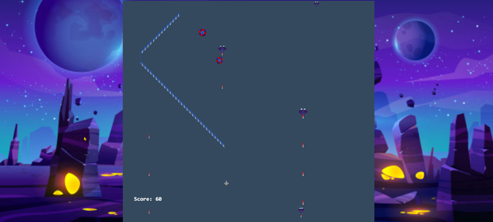

# Javascript-Capstone Project: Build a Shooter Game

<h1 align="center">
  Guns Of Boom
</h1>

> Final project in the Microverse JavaScript Curriculum

Implementation of a Space Shooter Game built with the [Phaser 3](https://phaser.io/phaser3) framework

## About The Project

The main objective of this project was to design and build a platform game. The basics of the game are used from the [Space Shooter Game](https://learn.yorkcs.com/category/tutorials/gamedev/phaser-3/build-a-space-shooter-with-phaser-3/) using Phaser and Javascript among other technologies.

Live version of the project: [Live version](https://guns-of-boom.netlify.app/)

Project Link: [Javascript-Capstone](https://github.com/somoye123/Shooter-Game)

## The game

In this never-ending game, you will face different enemies at random times, and you have to use your laser to make them explode. Every enemy gives you a different score point, and you need to avoid getting hit by their lasers or overlap with one of them. When the game is over , the user can restart the game.

### How to Play

- Input your name on the first page and click the submit button, There is a menu on the next page which are Play, Options, Credits and Scoreboard. You can disable the sound in the options menu. Click on the play menu to start your game. You can move around the screen using the arrow keys and use the Space Bar to shoot whenever you see an enemy. Happy gaming!

#### Get a local copy

_npm required_ - [get npm](https://www.npmjs.com/get-npm)

### Installation

You can always use the [live version](https://guns-of-boom.netlify.app/) to play right away or install it locally using these steps:

**Clone the repository by running this command in your terminal**

```
git clone https://github.com/somoye123/Shooter-Game
```

**Navigate into the newly created folder**

```
cd Shooter-Game
```

#### Get the dependencies needed for the game

`$ npm install`

#### Start the server

`$ npm run start`

**Visit this link to see the game in your browser**

```
http://localhost:8080/
```

**Run Jest tests**

```
npm run test
```

### Scenes

**Landing Scene**

<p align="center">
  
</p>

**Game Scene**

<p align="center">
  
</p>

**Credits Scene**

<p align="center">
  
</p>

**Leaderboard Scene**

<p align="center">
  
</p>

**Game Over Scene**

<p align="center">
  
</p>

## Technologies used

- HTML5/CSS
- Phaser 3
- Webpack
- Javascript
- Eslint
- Babel
- Jest for testing
- [Netlify](https://www.netlify.com/) for deployment
- [Leaderboard API service](https://www.notion.so/Leaderboard-API-service-24c0c3c116974ac49488d4eb0267ade3) for high scores

## Author

👤 **Somoye Ayotunde**

- Github:[@somoye123](https://github.com/somoye123)
- Twitter:[@ayotunde_197](https://twitter.com/ayotunde_197)
- LinkedIn:[Somoye Ayotunde](https://www.linkedin.com/in/somoye-ayotunde-03a471161)
- Mail: [somoye.ayotunde@gmail.com](somoye.ayotunde@gmail.com)

## Contributing

Contributions, issues and feature requests are welcome!

Feel free to check the [issues page](https://github.com/somoye123/Shooter-Game/issues).

## Show your Support

Give a ⭐️ if you like this project!

## Acknowledgments

- [Microverse](https://www.microverse.org/)
- [Phaser](https://phaser.io/)
- [OpenGameArt](https://opengameart.org/)
- [https://learn.yorkcs.com/](https://learn.yorkcs.com/)